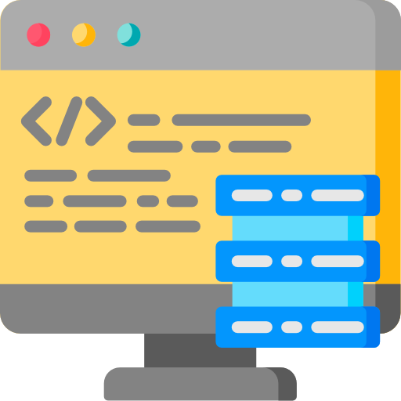

<p align="center">

</p>

[Link para wiki](https://gustavolima00.github.io/ScotlandYard/index.html)


# ScotlandYard App

## O que é o ScotlandYard
ScotlandYard é um jogo de tabuleiro jogado com o auxílio do app.

Para saber mais acesse nossa wiki:

<a href="https://gustavolima00.github.io/ScotlandYard/index.html"></a>

## Instalação

O app se encotra disponível na google play para instalação 

<a href="https://play.google.com/store/apps/details?id=com.gustavolima00.scotlandgame"></a>

[ ](https://play.google.com/store/apps/details?id=com.gustavolima00.scotlandgame)
## Como rodar

Para rodar o servidor localmente é necessário ter os **yarn**, **npm** e**expo-cli** instalados. Logo após é só rodar os comandos:
```shell
$ yarn
$ yarn start
```
E Seguir as instruções para rodar localmente ultilizando o **Expo**